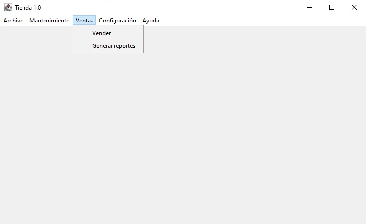
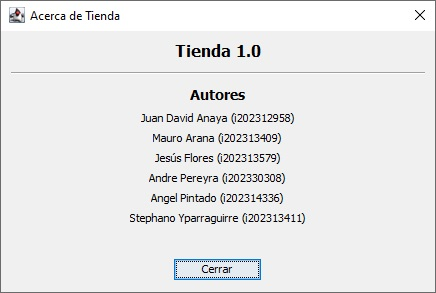

# Tienda de Ladrillos

Este proyecto fue creado en Java, utilizando Eclise IDE, Java Swing y WindowBuilder.
***
## Estructura del Proyecto

**Inicio:** Al abrir el programa este mostrará una ventana con una barra de navegación en la que podrá interactuar con las distintas funciones.

**Archivo:** Permite cerrar el programa.

**Mantenimiento:** Accedemos a las opciones para Consultar ladrillo, Modificar ladrillo y Listar ladrillos.

- **Consultar ladrillo:** Despliega un cuadro de dialogo que muestra todos los datos de cada modelo.
    Dentro del cuadro se encuentran datos como:

    -	Precio (S/)
    -	Ancho (cm)
    -	Largo (cm)
    -	Espesor (mm)
    -	Cantidad Óptima (millares)
    
    
    
    
- **Modificar ladrillo:** Despliega un cuadro de dialogo que permite modificar los datos de cada modelo.

    

    Después de realizar una modificación se desplegará un nuevo cuadro de dialogo en el que se detalla cada cambio realizado:
    
    
    
- **Listar ladrillo:** Despliega un cuadro de diálogo que muestra los detalles de todos los ladrillos

    

**Ventas:** Accedemos a las opciones para Vender y Generar Reportes.

- **Vender:** Despliega un cuadro de diálogo en el que se pueden realizar ventas indicando la cantidad.

    

    - **Boleta:** Despues de realizar una venta se genera una factura en pantalla.
    
    
    
    - **Avance de ventas:** Además se muestra el total generado en ventas.
    
    
    
- **Generar reportes:** Despliega un cuadro de diálogo en el que se pueden visualizar los distintos tipos de reportes.

    

    - **Ventas por modelo:** Imprime las veces que se han vendido, las cantidades vendidas y el importe total acumulado.
    
        
    
    - **Comparación con el precio promedio:** Imprime el precio del producto, el precio promedio y la comparación entre estos dos.
    
        
    
    - **Comparación con la cantidad óptima:** Imprime las cantidades vendidas, la cantidad óptima por la tienda y la comparación entre estos dos.
    
        
    
    - **Estadística general:** Imprime las estadísticas generales: Precio promedio, precio mayor, precio menor y la cantidad ded modelos no vendidos.
    
        
    
**Configuración:** Accedemos a las opciones de Configurar descuentos y configurar obsequio

- **Configurar descuentos:** Despliega un cuadro de diálogo en el que se pueden configurar los porcentajes de descuento en base a la cantidad vendida.

    
    
- **Configurar obsequio:** Despliega un cuadro de diálogo en el que se puede configurar la cantidad de obsequios en base a la cantidad vendida.

    
    
**Ayuda:** Accedemos a la opción Acerca de.
- **Acerca de:** Despliega un cuadro de diálogo en el que se muestran los datos de los desarrolladores.

    
***
## Contribuidores

- Juan David Anaya
- Mauro Arana
- Jesús Flores / [@jesusflsa](https://github.com/jesusflsa)
- Andre Pereyra
- Angel Pintado
- Stephano Yparraguirre / [@wismo-s](https://github.com/wismo-s)
